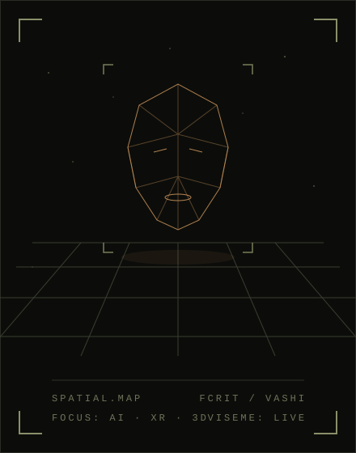

  

  
  
  

<table>
<tr>
<td width="34%" valign="top">
  
</td>
<td width="66%" valign="top">

## `ABOUT.md`

I build **AI-driven XR experiences**: 3D avatars that talk, listen and **lip-sync in Indic languages**, and **WebAR** that runs straight from a browser. Recent work spans an AR/VR financial chatbot with a custom Blender → Unity avatar, phoneme-to-viseme facial animation, a QR-based WebAR food preview, and an AI voice agent for dealer complaints.

Final-year Computer Engineering at FCRIT, Vashi. **Open to AI + XR / AR/VR / 3D / spatial computing roles.**

</td>
</tr>
</table>

  

## `STACK.cfg`

   
  

  <b>XR pipeline</b>: Blender · Maya → GLB / glTF → Unity · AR Foundation · MindAR · A-Frame · Three.js / WebGL 
  <b>AI layer</b>: NLP · LLM APIs (OpenAI) · Indic speech · phoneme → viseme lip-sync

## `BUILD_LOG`

> **AP-01 // InfinityPool branch** · 1 year
> Built **Shankh**, an AR/VR financial chatbot that converses in **Indic languages** through a custom 3D avatar (**Blender → Unity, C#**). AI/NLP integration, Indic speech and lip-sync (phoneme → viseme), and the backend APIs connecting it all. Private repository (AR chatbot), happy to walk through it.

> **AP-01 // Shankh AR** · [live demo](https://ar-bye.vercel.app) · [ar-bye](https://github.com/allen1407/ar-bye)
> WebAR spin-off: the animated Shankh avatar anchored to a printed marker using **MindAR image tracking + A-Frame + Three.js**, with a Draco-compressed GLB. No app install.

> **AP-01 // Kansai Nerolac branch** · Jun — Jul 2026
> Digital team (IT/SAP Support): contributed to an **AI voice agent for dealer complaints**, process automation, and a **Microsoft Power Pages** self-service portal.

> **AP-01 // independent branch**
> **PlateVerse**: scan a QR code and preview the dish as an interactive 3D model in the browser (**WebAR · Three.js · WebGL · GLB**). 
> **Indic Lip-Sync / Viseme Engine**: phoneme-to-viseme mapping driving blend-shape facial animation on Blender-built avatars.

> **AP-01 // IISER Mohali branch** · 15 days
> Machine learning internship: built and evaluated ML models and analysed data.

**Public repos:**

  
  
  

## `EXPERIENCE.log`

| Period | Org | Role |
|:---:|:---:|:---:|
| 1 year | InfinityPool Finnotech Pvt. Ltd. | Software Engineering Intern |
| Jun 2026 — Jul 2026 | Kansai Nerolac Paints Ltd. | IT Intern (Digital, IT/SAP Support) |
| 15 days | IISER Mohali | Machine Learning Intern |

## `ACHIEVEMENTS.log`

- 🥇 **First Prize**, Sparkathon (idea presentation competition)
- 🏆 **Best Mini Project Award**, academic year 2024–25
- 💼 **Treasurer**, CSI FCRIT (Computer Society of India)

SYS.LOG // END OF FILE

