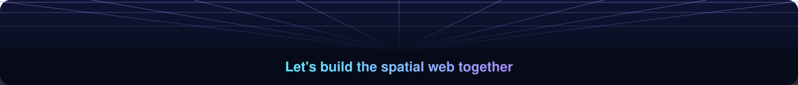

  

  

  
  
  

 

### 🥽 What I'm building

<table>
<tr>
<td width="50%" valign="top">

**Shankh: AR/VR Financial Chatbot** &nbsp;`🔒 private`

A financial chatbot that holds conversations in **Indic languages** through a custom 3D avatar built in Blender and brought to life in Unity.

   

Code is private (InfinityPool). Happy to walk through it.

</td>
<td width="50%" valign="top">

**Shankh AR** &nbsp;[`▶ live demo`](https://ar-bye.vercel.app) · [`repo`](https://github.com/allen1407/ar-bye)

Point your phone at a printed marker and the animated Shankh avatar appears on it. Runs in the browser, no app install.

   

</td>
</tr>
<tr>
<td width="50%" valign="top">

**Indic Lip-Sync / Viseme Engine**

Maps Indic-language speech phonemes to visemes and drives blend-shape facial animation, so avatars' mouths match what they say.

  

</td>
<td width="50%" valign="top">

**PlateVerse: AR Food Preview**

Diners scan a QR code and see the dish as an interactive 3D model in their browser before they order.

   

</td>
</tr>
</table>

### 🧭 Journey

- **Software Engineering Intern** · InfinityPool Finnotech · *1 year* 
  Developed Shankh: designed the Blender avatar, integrated it in Unity, and worked on AI/NLP, Indic speech and lip-sync, and backend APIs.
- **IT Intern, Digital team** · Kansai Nerolac Paints · *Jun – Jul 2026* 
  Contributed to an AI voice agent for dealer complaints, process automation, and a Microsoft Power Pages self-service portal.
- **Machine Learning Intern** · IISER Mohali · *15 days* 
  Built and evaluated ML models on research data.
- **B.Tech, Computer Engineering** · FCRIT, Vashi · *May 2027*

### 🧰 Toolkit

<table>
<tr>
<td width="140"><b>XR &amp; 3D</b></td>
<td> AR Foundation · MindAR · A-Frame · WebGL · Maya</td>
</tr>
<tr>
<td width="140"><b>AI / ML</b></td>
<td> NLP · LLM APIs</td>
</tr>
<tr>
<td width="140"><b>Languages</b></td>
<td></td>
</tr>
<tr>
<td width="140"><b>Backend &amp; Cloud</b></td>
<td></td>
</tr>
</table>

### 📊 Activity

  
  

  

### 🏅 Highlights

🥇 First Prize, Sparkathon &nbsp;·&nbsp; 🏆 Best Mini Project Award 2024–25 &nbsp;·&nbsp; 💼 Treasurer, CSI FCRIT

  

